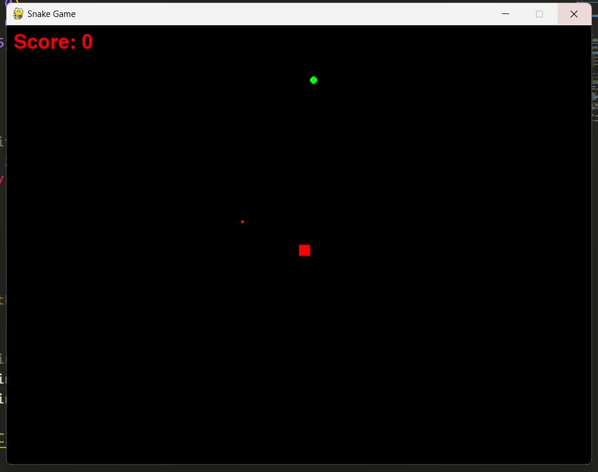
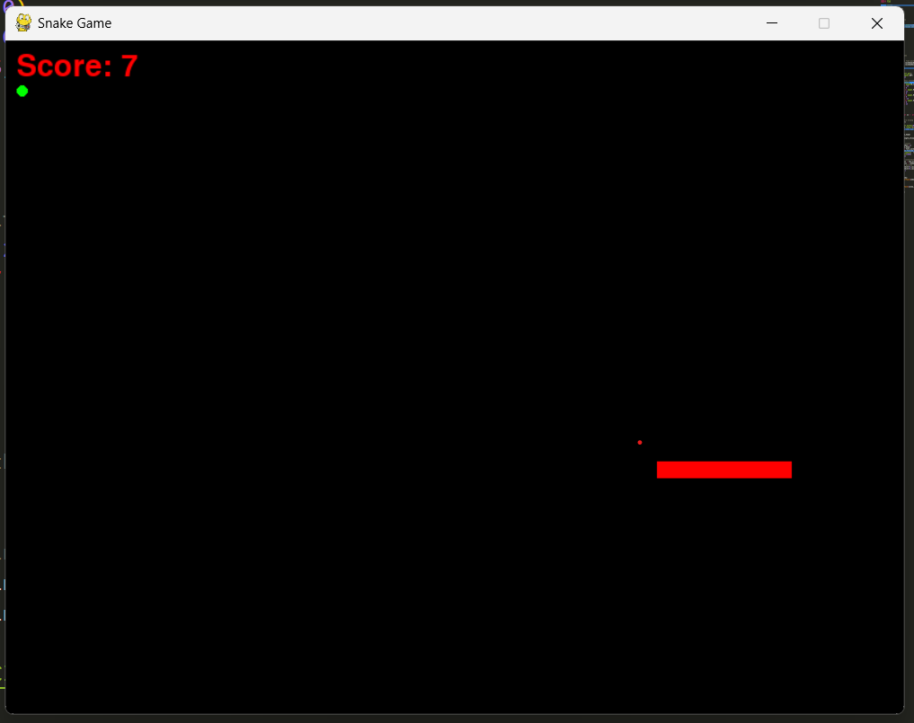

<h1>Snake Quest</h1>

<h3>Features</h3>
<ul>
  <li>Classic snake game play</li>
  <li>Simple and intuitive controls</li>
  <li>Increasing difficulty as snake grows</li>
  <li>Score Tracking system</li>
</ul>

<h3>How to play</h3>
<ol>
  <li>Run the game</li>
  <li>Use the arrow keys to control the snake</li>
  <ol>
    <li>Up Arrow: Move Up</li>
    <li>Down Arrow: Move Down</li>
    <li>Left Arrow: Move Left</li>
    <li>Right Arrow: Move Right</li>
  </ol>
  <li>The game ends if the snake collides with itself or walls</li>

  
  
</ol>
